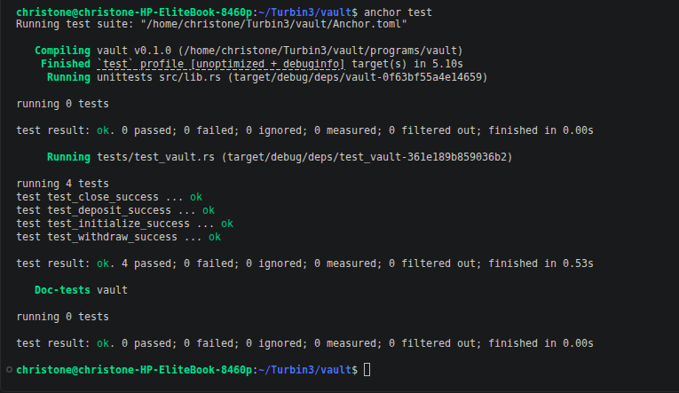

# Solana Secure Escrow Program

A secure, trustless asset-swapping Escrow protocol built on Solana using the **Anchor (v0.30+)** framework. This program acts as a decentralized third-party intermediary, allowing two unfamiliar participants (**Maker** and **Taker**) to safely exchange SPL tokens or native currency without relying on mutual trust.

The entire suite is verified end-to-end using **LiteSVM** for rapid, high-fidelity integration testing entirely in Rust.

---

## Integration Test Suite Performance

We use **LiteSVM**—a blazingly fast, lightweight replica of the Solana VM—to evaluate edge cases locally without the heavy memory footprint or overhead of a local validator.

### All Program Instructions Passing
 


---

## Protocol Lifecycle & Core Instructions

The escrow relies on a state account PDA (`EscrowState`) to enforce trade criteria and an isolated Token Account PDA (`Vault`) to safely lock up assets until fulfillment.

1. **`make`**: The **Maker** initializes the `EscrowState` contract parameters (specifying a dynamic unique seed, exchange asset pairing, and price) and locks up Token A into the program's secure `Vault`.
2. **`update`**: The **Maker** can dynamically alter the amount of Token B they require before a Taker signs, adapting to real-time market shifts without canceling the contract.
3. **`take`**: A **Taker** pays the required amount of Token B directly to the Maker's wallet. The program then releases the locked Token A from the `Vault` to the Taker and instantly sweeps all remaining account rent back to the Maker.
4. **`refund`**: If a trade counterparty is never found, the **Maker** can cancel the escrow. The program returns Token A from the `Vault` back to the Maker's wallet and tears down all allocated account structures.

---

## Project Directory Layout

```text
anchor-escrow/
├── programs/anchor-escrow/src/   # Core smart contract code
├── tests/
│   └── test_escrow.rs            # Single-file comprehensive LiteSVM tests
├── Anchor.toml                   # Anchor configuration pointing to cargo test
└── README.md                     # Documentation
```

---


## Contact
* **Nwaburu Emeka Christian** - [GitHub Profile](https://github.com/Christone007)
* **Email:** exellentemy@gmail.com
